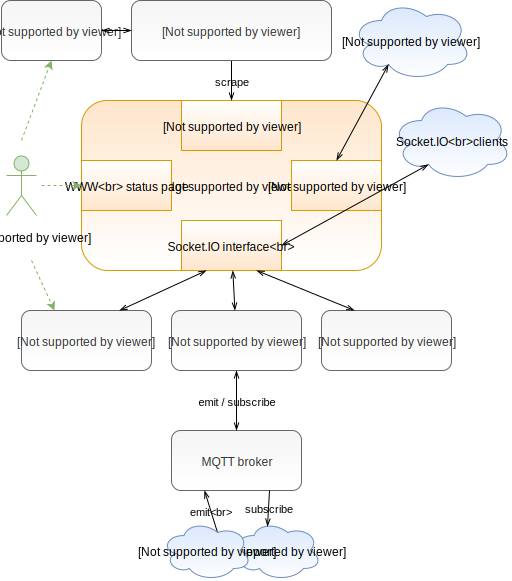

# Switchboard

- a gateway for processing metrics with automation and states
- acceptor for sensors, batch jobs or messages
- with the ability to set actuators
- compatible with Prometheus for metric alerting, collecting and data visualization
 
## Schema:



## Features:

 - can evaluate, recalculate or correct metric
 - calculate new metric or state from other metrics
 - automation using a true algorithmization + data structures (python expression code)
 - can set TTL for metrics (obsolete metric disappears when time is over)
 - communicates via:
    * RESTful API 
    * realtime, bidirectionally using Socket.IO
    * exporting data as Prometheus metrics
    * live www status page
 - optional bridges (extensions):
    * [switchboard-mqtt](https://github.com/vinklat/switchboard-mqtt) to connect a large family of devices using MQTT protocol
    * switchboard-journal to store all events into database for forensic purposes (not done)
    * switchboard-panel to invoke and display states using a web page (not done)

## Quick HOWTO:
### Example 1: a weather station gateway

 - some sensor sends temperature and relative humidity data to this gateway
 - temperature will be corrected (slope +1% and shift + 0.5) maybe because the sensor might not be accurate :)
 - other two metrics will be calculated (dew point temperature and absolute humidity)
 - for an inactive sensor, the data expires in 10 minutes

#### a) run the docker image using the built-in example:
(the content of this config file can be seen here [example_switch1.yml](conf/example_weatherstation.yml))

`docker run -p 9128:9128 vinklat/switchboard -c conf/example_weatherstation.yml`

#### b) send metrics from sensor via REST API

you can simulate it using curl:  

`curl http://localhost:9128/api/metrics/weather1 -d temp_celsius=37.5 -d hum_ratio=0.8 -X PUT`

#### c) watch status
 - live status page: [http://localhost:9128](http://localhost:9128)
 - JSON response of REST API: [http://localhost:9128/api/metrics/by_node](http://localhost:9128/api/metrics/by_node)
 - Prometheus metrics: [http://localhost:9128/prom](http://localhost:9128/prom)

### Example 2: two on/off switches and the light

We have the following scenario:  


- the light is active when at least one switch is turned on

#### a) run docker image:
`docker run -p 9128:9128 vinklat/switchboard -c conf/example_switch1.yml`

(the content of this config file can be seen here [example_switch1.yml](conf/example_switch1.yml))

#### b) hit switches:

you can control switches via REST API using curl:  

```
curl http://localhost:9128/api/metrics/switch1 -d switch_state=on -X PUT
curl http://localhost:9128/api/metrics/switch1 -d switch_state=off -X PUT
curl http://localhost:9128/api/metrics/switch2 -d switch_state=on -X PUT
curl http://localhost:9128/api/metrics/switch2 -d switch_state=off -X PUT
```
#### c) watch the status web page or scrape metrics by Prometheus :)
