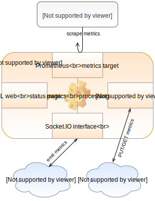

# Laporte

- a gateway for processing metrics with automation and states
- acceptor for sensors, batch jobs or messages
- with the ability to set actuators
- compatible with Prometheus for metric alerting, collecting and data visualization
 
## Schema:

## Features:

 - can evaluate, recalculate or correct metric
 - calculate new metric or state from other metrics
 - automation using a true algorithmization + data structures (python expression code)
 - can set TTL for metrics (obsolete metric disappears when time is over)
 - communicates via:
    * RESTful API 
    * realtime, bidirectionally using Socket.IO
    * exporting data as Prometheus metrics
    * live www status page
 - optional bridges (extensions):
    * [laporte-mqtt](https://github.com/vinklat/laporte-mqtt) to connect a large family of devices using MQTT protocol
    * [laporte-journal](https://github.com/vinklat/laporte-journal) to store all events into other database

## Installation:
To install Laporte from PyPI:

`pip install laporte`

Or using container image from Docker Hub:

`docker pull vinklat/laporte`

## Quick HOWTO:
### Example: push gateway for weather sensor

 - manually simulate a weather sensor and send temperature and relative humidity data to this gateway using REST API
 - in this example the temperature will be corrected (slope +1% and shift + 0.5). Can be used in case of calibrate sensor, unit conversion, ...
 - other two new metrics will be calculated (dew point temperature and absolute humidity)
 - in the case of an inactive sensor, the data expires in 10 minutes

#### a) run the docker image

`docker run -p 9128:9128 vinklat/laporte -c conf/example_weatherstation.yml`

(the content of this built-in config file can be seen here: [example_weatherstation.yml](conf/example_weatherstation.yml))

#### b) send metrics from sensor via REST API

Try sending data several times using curl:

`curl http://localhost:9128/api/metrics/weather1 -d temp_celsius=37.5 -d hum_ratio=0.8 -X PUT`

#### c) watch status
 - Laporte status page: [http://localhost:9128](http://localhost:9128)
 - JSON response of REST API: [http://localhost:9128/api/metrics/by_node](http://localhost:9128/api/metrics/by_node)
 - Prometheus metrics: [http://localhost:9128/prom](http://localhost:9128/prom)

...more info on the [wiki](https://github.com/vinklat/laporte/wiki)
